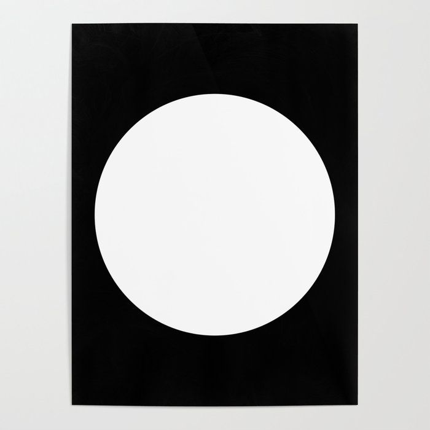
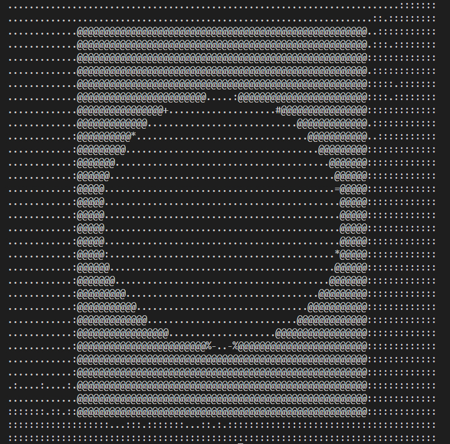
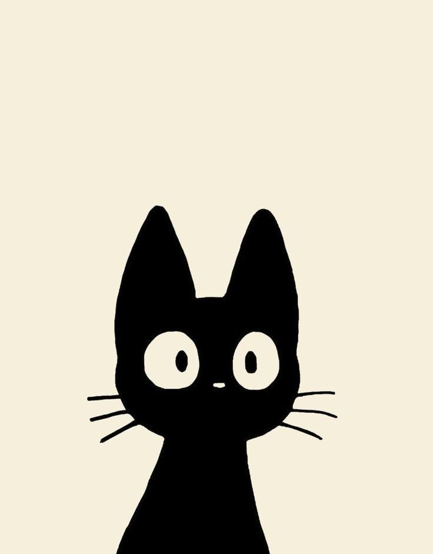
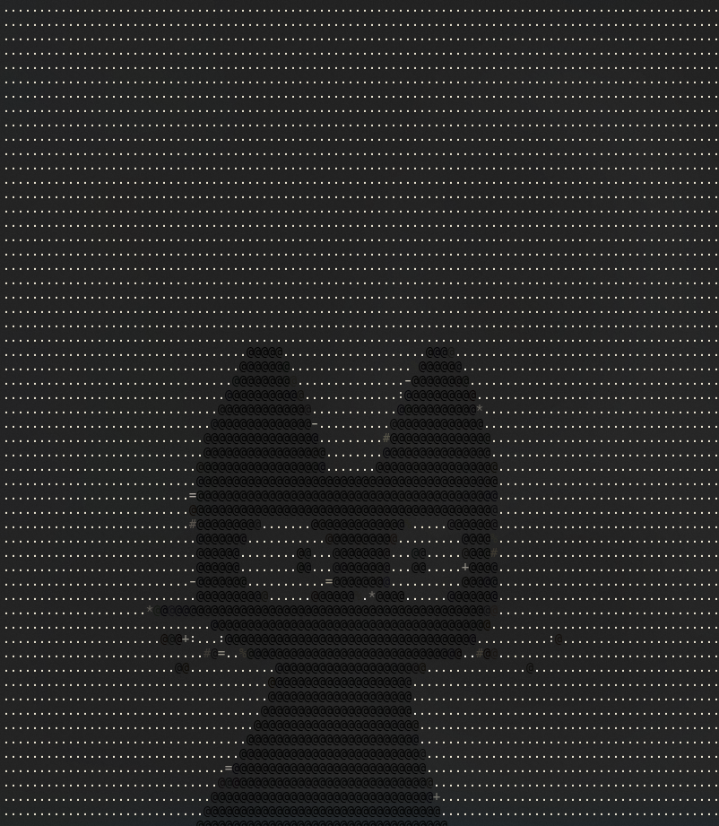
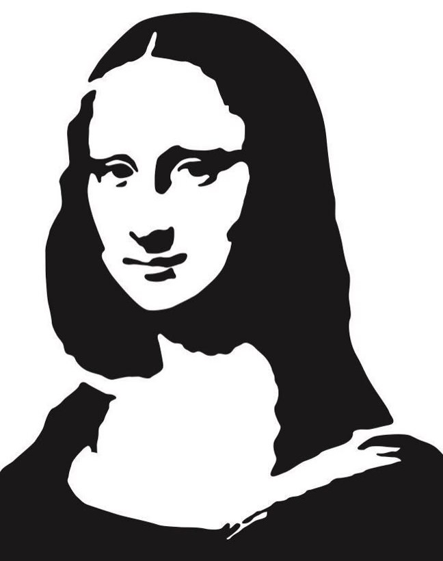
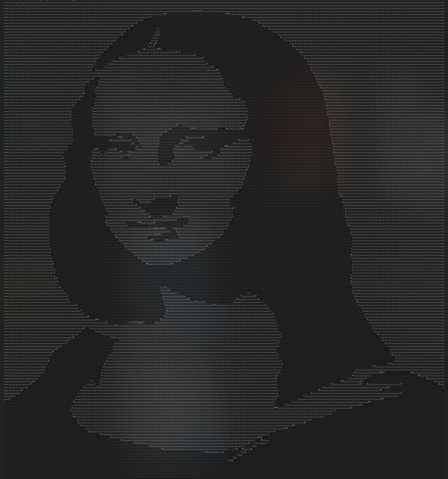
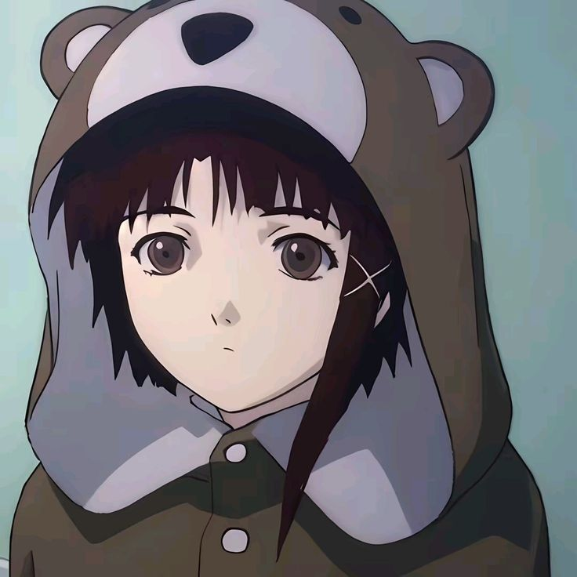
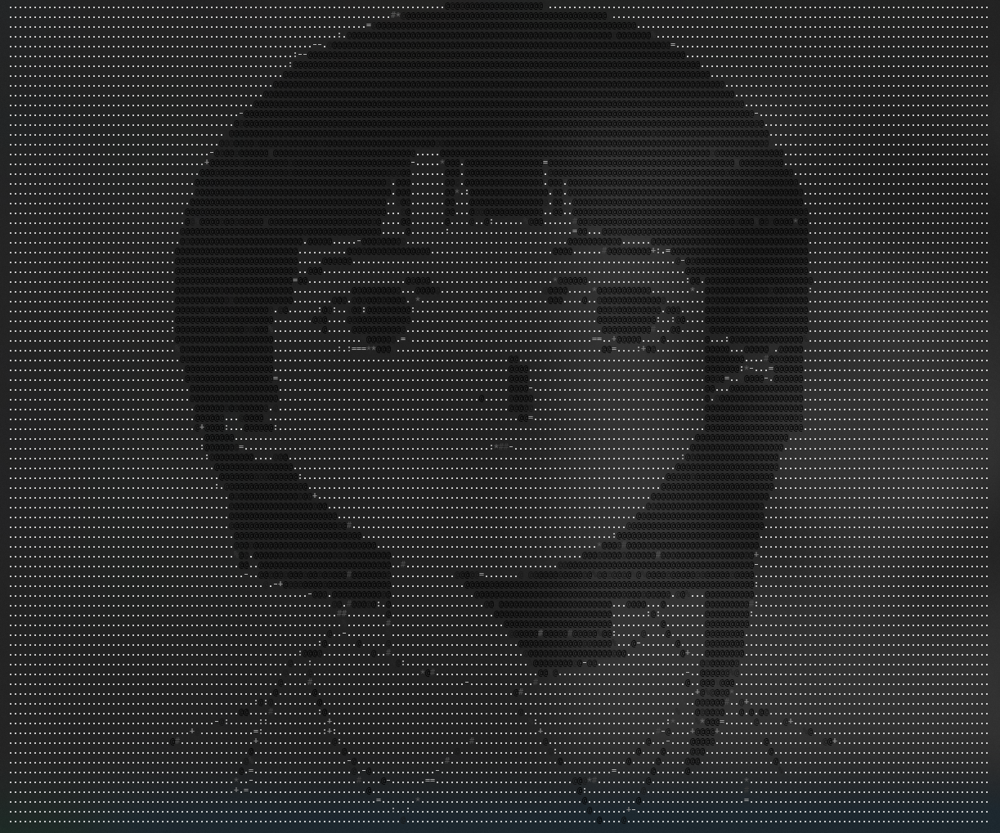
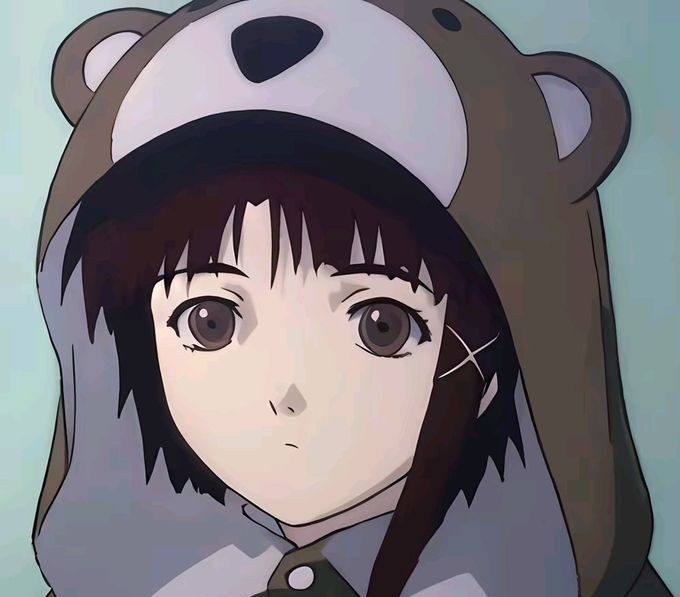
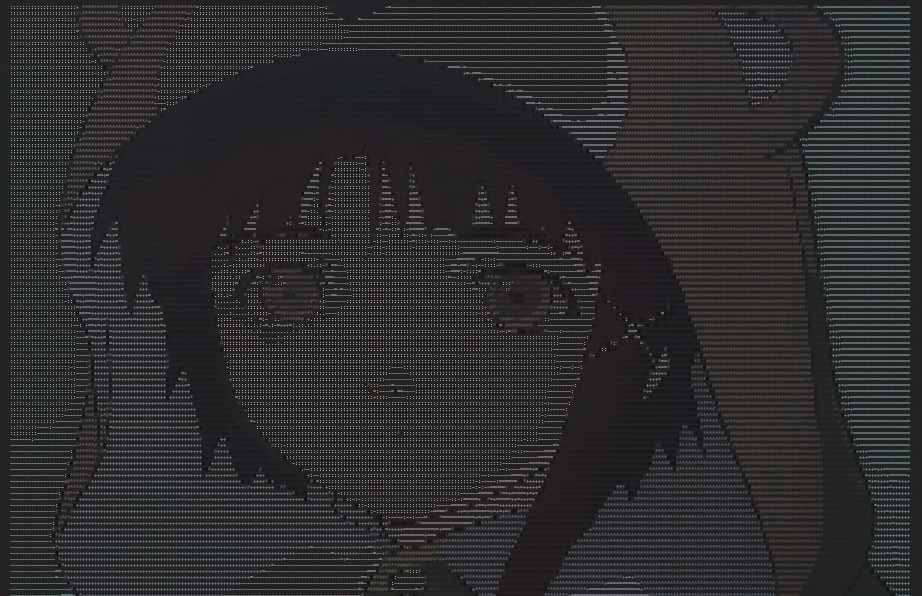

# img2ascii

A Rust project that converts images to ASCII art in the terminal with optional support for custom dimensions, vibrant 24-bit true color output, and advanced image processing features including Sobel edge detection.

## Examples

| Example            | Original                         | ASCII Output                                |
| ------------------ | -------------------------------- | ------------------------------------------- |
| **Circle**         |             |       |
| **Cat**            |                   |                   |
| **Mona Lisa**      |        |        |
| **Lain**           |                 |                 |
| **Lain (Colored)** |  |  |

---

## Installation

Install img2ascii using Cargo (Rust package manager):

```bash
cargo install img2ascii-cli
```

This installs the img2ascii command globally.

## Usage

### Basic usage

Convert an image to ASCII art in the terminal:

```bash
img2ascii image.jpg
```

Outputs ASCII art with a default width of 80 characters.

### Set output width

Control the width (in characters) of the ASCII output:

```bash
img2ascii image.jpg --width 60
```

or shorthand:

```bash
img2ascii image.jpg -w 60
```

---

### Tip: Detail & Width

**For more detailed ASCII art output, increase the width!** The larger the width value, the more characters are used to represent the image, which preserves more details and produces a more refined result.

- **Small width (40-60)**: Simpler, bolder appearance
- **Medium width (80-100)**: Balanced detail and visibility
- **Large width (120+)**: Maximum detail and fine features

Example:

```bash
cargo run -- circle.jpg -w 40    # Simple version
cargo run -- circle.jpg -w 120   # Detailed version
```

**Default** (width=80, height auto-calculated with aspect ratio correction):

```bash
cargo run -- circle.jpg
```

**Custom width**:

```bash
cargo run -- circle.jpg --width 100
```

**Custom width and height** (no aspect ratio correction applied):

```bash
cargo run -- circle.jpg --width 100 --height 50
```

**Short flags**:

```bash
cargo run -- circle.jpg -w 100 -H 50
```

**Colored ASCII art**:

```bash
cargo run -- circle.jpg --color
```

**Colored with custom dimensions**:

```bash
cargo run -- circle.jpg -c -w 120 -H 40
```

**Edge detection mode** (creates sketch-like effect):

```bash
img2ascii image.jpg --edges
```

**Edge detection with custom threshold**:

```bash
img2ascii image.jpg -e --edge-threshold 120
```

**Combine edge detection with color**:

```bash
img2ascii image.jpg --edges --color
```

---

## Command-line Flags

| Flag                       | Description                                                                   |
| -------------------------- | ----------------------------------------------------------------------------- |
| `-w, --width <WIDTH>`      | Width of ASCII output in characters _(default: 80)_                           |
| `-H, --height <HEIGHT>`    | Height of ASCII output in characters _(optional, overrides auto-calculation)_ |
| `-c, --color`              | Enable colored ASCII art output using ANSI 24-bit true color                  |
| `-e, --edges`              | Apply Sobel edge detection before conversion (sketch effect)                  |
| `--edge-threshold <0-255>` | Edge detection sensitivity threshold _(default: 100)_                         |
| `-o, --output <FORMAT>`    | Save to file: `txt`, `html`, or `ansi` _(terminal output always shown)_       |

## Features

### Core Features

- **ASCII Art Conversion**: Maps image brightness to ASCII characters (`@%#*+=-:. `)
- **True Color Support**: 24-bit ANSI color codes for accurate color reproduction
- **Aspect Ratio Correction**: Automatically adjusts for terminal character dimensions (0.43 factor)
- **Multiple Output Formats**: Terminal, plain text, HTML, and ANSI file formats
- **Flexible Sizing**: Custom width/height or automatic aspect-ratio-based sizing

### Image Processing Features

#### Edge Detection (Sobel)

- **Algorithm**: Sobel convolution with Euclidean norm for gradient magnitude
- **Color Preservation**: Maintains original RGB colors on detected edges
- **Configurable Threshold**: Adjust sensitivity (0-255, default: 100)
- **Processing Order**: Applied before resize for maximum accuracy
- **Use Cases**: Create sketch-like effects, emphasize contours, artistic rendering

## Processing Pipeline

The conversion process follows a modular pipeline architecture:

```
1. Image Loading (core.rs)
   └─> Load and validate image file
        ↓
2. Edge Detection [Optional] (edge.rs)
   └─> Apply Sobel convolution before resize
   └─> Preserves colors, highlights edges
        ↓
3. Image Resizing (core.rs)
   └─> Calculate aspect ratio with character correction (0.43)
   └─> Resize to target dimensions
        ↓
4. ASCII Conversion (convert.rs)
   └─> Calculate luminance (0.299*R + 0.587*G + 0.114*B)
   └─> Map brightness to ASCII characters: "@%#*+=-:. "
   └─> Preserve RGB color values
        ↓
5. Rendering (renderansi.rs / renderhtml.rs)
   └─> Format output based on selected format
   └─> Apply ANSI color codes or HTML styling
        ↓
6. Output (core.rs / output.rs)
   └─> Display in terminal (always)
   └─> Save to file (if --output specified)
```

### Output Format Details

```bash
img2ascii image.jpg              # → terminal only (default)
img2ascii image.jpg -o txt       # → image.txt (plain ASCII, no color)
img2ascii image.jpg -o html      # → image.html (styled HTML with colors)
img2ascii image.jpg -o ansi      # → image.ansi (ANSI codes for terminal replay)
img2ascii image.jpg --output txt # → long form flag
```

**Note**: Terminal output is always displayed. The `--output` flag additionally saves to a file.

````

### Prerequisites

Install Rust by running:

```bash
curl --proto '=https' --tlsv1.2 -sSf https://sh.rustup.rs | sh
```

Verify installation:

```bash
rustc --version
cargo --version
```

### Build

```bash
cargo build
```

### Run

```bash
cargo run -- <image> [OPTIONS]
```

---

### Module Responsibilities

- **main.rs**: Entry point, module declarations
- **cli.rs**: Command-line argument parsing with clap
- **core.rs**: Orchestrates the entire pipeline
- **edge.rs**: Sobel edge detection with color preservation
- **convert.rs**: Pixel-to-ASCII conversion logic
- **types.rs**: Shared data structures and utilities (AsciiCell, luminance calculation)
- **renderansi.rs**: ANSI terminal output with 24-bit color codes
- **renderhtml.rs**: HTML output with inline CSS styling
- **output.rs**: Filename generation for saved files

## License

This project is for learning and development purposes.

---
````
